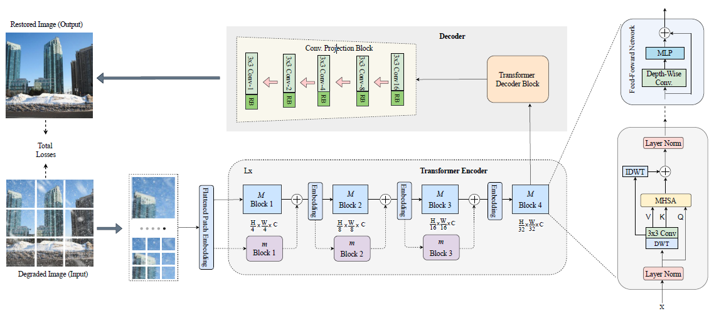
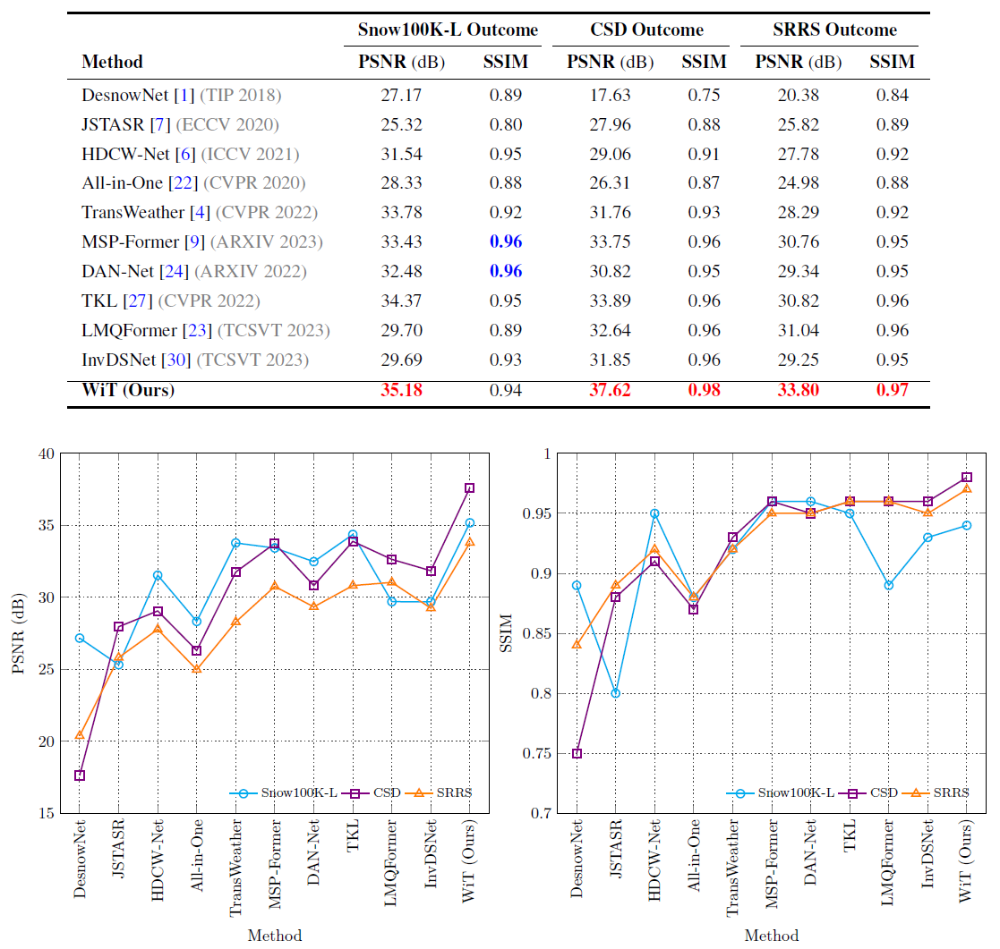
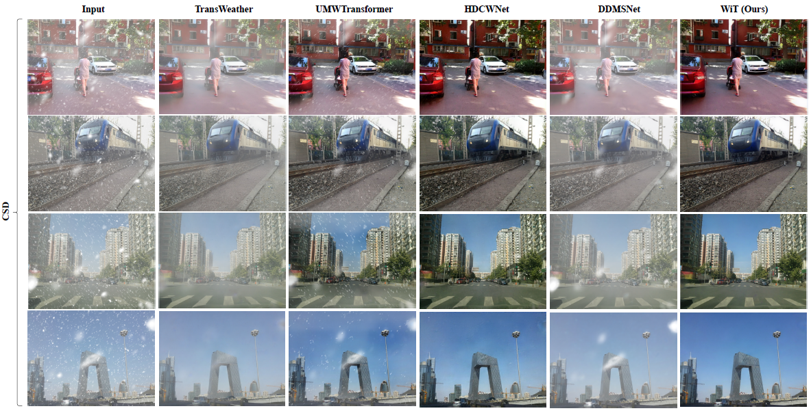

# WiT Network

<a href="https://ieeexplore.ieee.org/document/10246273"> </a>

This is the implementation code for the paper *titled:* **[Restoring Snow-Degraded Single Images With Wavelet in Vision Transformer](https://ieeexplore.ieee.org/document/10246273)**, 
IEEE Access 2023.

<p align="left">
  
</p>

# Executive Summary:

Images corrupted by snowy adverse weather can impose performance impediments to critical high-level vision-based applications. Restoring snow-degraded images is vital, but the task is ill-posed and very challenging due to the veiling effect, stochastic distribution, and multi-scale characteristics of snow in a scene. In this regard, many existing image denoising methods are often less successful with respect to snow removal, being that they mostly achieve success with one snow dataset and underperform in others, thus questioning their robustness in tackling real-world complex snowfall scenarios. In this paper, we propose the wavelet in transformer (WiT) network to address the image desnow inverse problem. Our model exploits the joint systemic capabilities of the vision transformer and the renowned discrete wavelet transform to achieve effective restoration of snow-degraded images. In our experiments, we evaluated the performance of our model on the popular SRRS, SNOW100K, and CSD datasets, respectively. The efficacy of our learning-based network is proven by our obtained numeric and qualitative result outcomes indicating significant performance gains compared to image desnow benchmark models and other state-of-the-art methods in the literature.

# Getting Started:

We recommend Python3 versions from 3.7 to 3.8, and CUDA versions from 10.2 to 11.5

- Download or Clone this repository and create environment

```
git clone https://github.com/obinnadyke/WiT
cd WiT
```

- Install the package dependencies `pip3 install -r requirements.txt`.

- PyTorch environment with GPU support for Windows and Linux can be installed with Conda `conda install pytorch==1.7.1 torchvision==0.8.2 torchaudio==0.7.2 cudatoolkit=10.2 -c pytorch`.

- Download the test-set images from the dataset links below and arrange in a `data` folder. Optionally, you can `mogrify` the image data formats. For example `mogrify -format tif *.jpg && rm *.jpg` to change `.jpg` images to `.tif`.

- Find the `model_weights` [here](http://depositfiles.com/files/4ujd7vdcc) and the `dataset_filename.txt` samples [here](https://github.com/WINS-lab/WiT/tree/main/files). 

- For inference, edit `test.py` accordingly and run `python3 test.py -exp_name model_weight`. For example `python3 test.py -exp_name csd_weight` for csd test dataset.

## Data Arrangement

Create a `data` folder and arrange 2000 samples of the test input and groundtruth images as follows

```
    WiT
    |
    ├── data
    |   | 
    |   ├── test  # Test-set         
    |   |   ├── <dataset_name>          
    |   |   |   ├── input         # degraded images 
    |   |   |   └── gt            # clean images
    |   |   └── dataset_filename.txt
```

# Datasets:

Use the link and download the respective snow-image datasets to evaluate the WiT network
- SNOW100K-L 
- SRRS 
- CSD

|                                          Snow100K                                           |                                          SRRS                                          |                            CSD                             |
:------------------------------------------------------------------------------------------------:|:----------------------------------------------------------------------------------------------:|:----------------------------------------------------------------------------------------------:
 [Download link](https://sites.google.com/view/yunfuliu/desnownet) | [Download link](https://ntucc365-my.sharepoint.com/:u:/g/personal/f05943089_ntu_edu_tw/ER0rk5-CgCxDhSw-6DS0scQBh9N_V49Gt6fAZb25qs4Pnw?e=SpxEM5) | [Download link](https://drive.google.com/file/d/1smNrDvtPs89e0xk336Rt2-2KZffyX5H-/view)

# Results:

Qualitative PSNR and SSIM (numeric) results
<p align="left">
  
</p>

Quantitative (visual) results evaluated on the CSD dataset
<p align="left">
  
</p>

# Citation

Bibtex:
```
@article{WiTNet2023,
  author={Obinna Agbodike and Jenhui Chen},
  journal={IEEE Access},
  title={Restoring Snow-Degraded Single Images With Wavelet in Vision Transformer},
  month=sep,
  year={2023},
  volume={11},
  pages={99470--99480}}
```

## Acknowledgements
Useful blocks of code adapted in the WiT is credited to the contributions of [ImageNetModel](https://github.com/yehli/imagenetmodel), [TransWeather](https://github.com/jeya-maria-jose/TransWeather/), and [ViT-PyTorch](https://github.com/lucidrains/vit-pytorch) 
